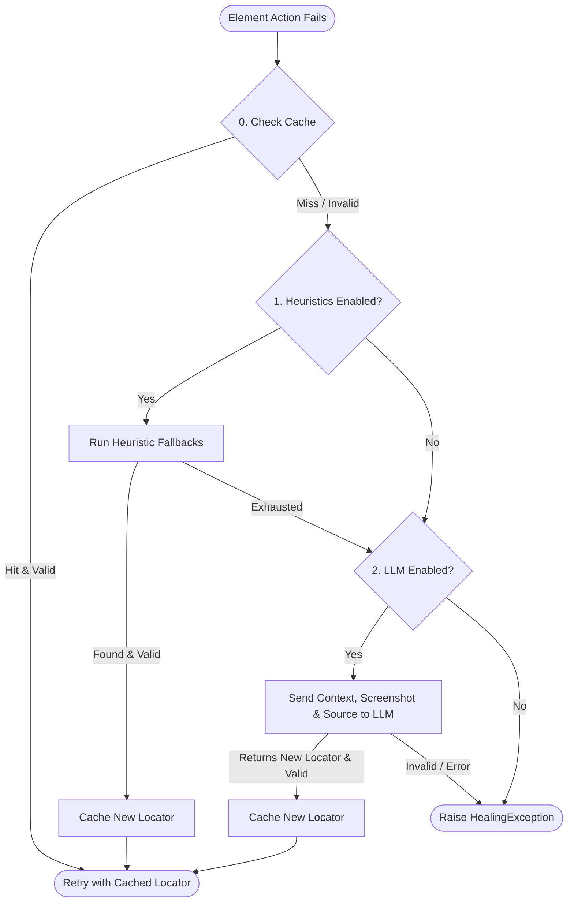

# AI Automation Framework 🤖

**Multi-platform automation framework with AI-powered element auto-healing.**

Supports **Web** (Playwright), **Android Native** (Appium), and **iOS Native** (Appium) — all through a unified Python API with automatic element healing when locators fail.

## ✨ Features

| Capability | Description |
|---|---|
| **🌐 Cross-platform** | Single API for Web, Android, iOS |
| **🧠 AI Auto-healing** | When an element locator fails, the framework auto-recovers via heuristic fallbacks → LLM analysis |
| **⚡ Heuristic fallback** | Zero-cost retry with alternative locator strategies (test_id → role → label → css → xpath → text) |
| **🤖 LLM healing** | Sends screenshot + page source to an LLM to determine the correct element |
| **💾 Healing cache** | Persists healed locators so they work on subsequent runs instantly |
| **📦 Page Object Model** | Clean, maintainable page objects with typed locators |
| **📸 Auto-fail artifacts** | Screenshots, page source, and healing reports on failure |
| **🔌 Pluggable LLM** | OpenAI, LiteLLM, Gemini, Anthropic, OpenCode |

## 📋 Architecture

```
ai-automation-framework/
├── src/autofw/
│   ├── core/              # Config, constants, exceptions
│   ├── locator/           # Multi-platform locator definitions
│   ├── healing/           # Heuristic + LLM healing pipeline & Cache
│   ├── elements/          # Unified element with auto-healing
│   ├── pages/             # Base page object
│   ├── utils/             # Logger, wait, screenshot helpers
│   ├── driver_factory.py  # Playwright + Appium driver factory
│   ├── conftest.py        # Pytest fixtures & hooks
│   └── __init__.py
├── config/
│   └── config.yaml        # Global configuration
├── tests/
│   ├── web/               # Web test examples
│   ├── android/           # Android test examples
│   └── ios/               # iOS test examples
└── requirements.txt
```

## 🚀 Quick Start

### 1. Install

```bash
# Clone / create project
cd ai-automation-framework

# Create virtual environment
python -m venv .venv
source .venv/bin/activate

# Install dependencies
pip install -r requirements.txt

# Install Playwright browsers
playwright install chromium
```

### 2. Configure

Edit `config/config.yaml` to set your platform and credentials:

```yaml
platform: web          # web | android | ios

web:
  browser: chromium
  headless: true       # Set false to watch tests run

android:
  appium_url: http://localhost:4723
  app: /path/to/app.apk

ios:
  appium_url: http://localhost:4723
  app: /path/to/app.app

healing:
  enabled: true
  cache:
    enabled: true
    db_path: ".healing_cache.json"
  heuristics:
    enabled: true
    max_attempts: 3
  llm:
    enabled: true
    provider: openai                # openai | litellm | gemini | anthropic | opencode
    api_key: "${OPENAI_API_KEY}"    # Or set env: HEALING_API_KEY
    model: gpt-4o-mini
    include_screenshot: true
```

### 3. Write a Page Object

```python
# tests/web/pages/login_page.py
from autofw.locator import Locator
from autofw.pages import BasePage

class LoginPage(BasePage):
    USERNAME_INPUT = Locator(
        name="Username input",
        web={"placeholder": "Email"},
        android={"accessibility_id": "emailInput"},
        ios={"accessibility_id": "emailInput"},
        description="Email text field on login form",
    )

    LOGIN_BUTTON = Locator(
        name="Login button",
        web={"role": "button", "name": "Sign in"},
        android={"accessibility_id": "loginButton"},
        ios={"accessibility_id": "loginButton"},
    )

    def login(self, username: str, password: str):
        self.element(self.USERNAME_INPUT).type(username)
        self.element(self.PASSWORD_INPUT).type(password)
        self.element(self.LOGIN_BUTTON).click()
```

### 4. Write Tests

```python
# tests/web/test_login.py
import pytest

@pytest.mark.web
class TestLogin:
    def test_successful_login(self, login_page):
        login_page.navigate_to("https://example.com")
        login_page.login("user@example.com", "securePass")
        assert "dashboard" in login_page.get_url()
```

### 5. Run

```bash
# Web tests
pytest tests/web/ --platform web -v

# Android tests (with Appium running)
pytest tests/android/ --platform android -v

# iOS tests (with Appium running)
pytest tests/ios/ --platform ios -v

# With healing disabled
pytest tests/web/ --platform web --disable-healing -v
```

## 🧠 How AI Healing Works

The framework implements a robust, multi-phase healing pipeline to ensure UI tests do not fail on trivial UI changes. When an action on an element fails (e.g., the element is not found within the timeout), the `HealingOrchestrator` is triggered automatically.

Here is the complete step-by-step flow of how healing works:



### Phase 0: Local Healing Cache
To ensure tests run fast and save API costs, the framework first checks the local cache (e.g., `.healing_cache.json`).
- If a previously healed locator exists for this page and element, it verifies its validity.
- If it's valid, it immediately reuses it.

### Phase 1: Heuristic Fallbacks (Zero-Cost Healing)
If the cache misses, the `HeuristicHealer` steps in. It attempts to derive a working locator without making external API calls, making it extremely fast and zero-cost.
- It determines the original failing locator strategy (e.g., `css`).
- It tries alternative locator strategies based on priority (`WEB_LOCATOR_PRIORITY`, `ANDROID_SPECIFIC_PRIORITY`, etc.) using the original value or derived values from the context.
- For Web, the priority order is typically: `test_id` → `id` → `role` → `label` → `placeholder` → `css` → `xpath` → `text` → `alt_text` → `title`.
- If an alternative strategy successfully locates the element, it is cached and the test continues.

### Phase 2: LLM Analysis
If all zero-cost heuristics are exhausted or fail, the framework delegates the problem to the `LLMHealer`.
- **Minification**: The current page source (HTML/XML) is minified (scripts, styles, SVG paths, and comments removed) to save token usage.
- **Context Collection**: The minified page source, a base64 screenshot (if enabled), and the element's metadata (original locator, description, page name) are compiled.
- **LLM Prompting**: The compiled context is sent to the configured LLM provider (`openai`, `litellm`, `gemini`, `anthropic`, or `opencode`) using a strict system prompt.
- **JSON Response**: The LLM acts as an expert QA engineer and returns a JSON object containing the `locator`, `confidence`, and `reason`.
- If the LLM successfully finds the element, the new locator is cached, and the test action is retried.

### Phase 3: Total Failure
If the LLM fails to find the element, returns an invalid response, or encounters an API error, a final `HealingException` is raised, gracefully failing the test.

## ⚙️ Configuration Reference

### CLI Options

| Flag | Description |
|---|---|
| `--platform web\|android\|ios` | Override target platform |
| `--config path/to/config.yaml` | Custom config path |
| `--disable-healing` | Disable AI healing entirely |
| `--heal-cache path/to/cache.json` | Custom healing cache path |

### Environment Variables

| Variable | Description |
|---|---|
| `HEALING_API_KEY` | API key for LLM healing |
| `OPENAI_API_KEY` | Fallback API key |
| `AUTOFW_PLATFORM` | Default platform override |

## 🏗️ Project Structure Best Practices

```
project/
├── tests/
│   ├── web/
│   │   ├── pages/         # Page objects for web
│   │   ├── components/    # Reusable component objects
│   │   └── test_*.py      # Web test files
│   ├── android/
│   │   ├── pages/         # Page objects for Android
│   │   └── test_*.py
│   └── ios/
│       ├── pages/         # Page objects for iOS
│       └── test_*.py
├── config/
│   ├── config.yaml        # Base config
│   └── environments/      # Per-environment overrides
└── reports/               # Test reports & artifacts
```

## 📄 License

MIT
